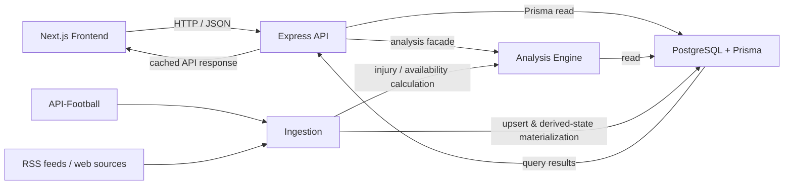

# SquadCheck

축구 경기 데이터와 부상 정보를 결합해 팀 전력 손실, 선수 영향도, 예상 라인업, 복귀 신호를 제공하는 분석 플랫폼입니다. 외부 스포츠 데이터와 뉴스 신호를 수집하고, 이를 일관된 데이터 모델에 저장한 뒤 API와 웹 UI에서 해석 가능한 결과로 제공합니다.

## Overview

- 선수 출전 기록과 포지션별 지표를 이용한 팀 내 상대적 기여도 산정
- 현재 부상자와 팀 전력 손실 비율, 경기 결과 영향도 분석
- 최근 라인업·포메이션·가용성 정보를 조합한 예상 라인업 제공
- RSS 및 웹 기사에서 회복·복귀 관련 신호를 수집해 가용성 판단 보조
- 관심 선수 변화를 감지하는 인증 기반 watchlist 기능

## Architecture



요청 경로는 `Frontend → API → Analysis/DB → API → Frontend`이고, 적재 경로는 `API-Football·RSS → Ingestion → DB → Analysis`입니다. 상세 설명은 [docs/architecture.md](docs/architecture.md)에서 확인할 수 있습니다.

## Tech Stack

| 영역 | 기술 |
| --- | --- |
| Frontend | Next.js 14, React 18, TypeScript, Tailwind CSS |
| API | Express, TypeScript, Vitest/Supertest |
| Database | PostgreSQL, Prisma ORM |
| Ingestion | Axios, node-cron, rss-parser, Cheerio, Playwright/Lightpanda |
| Analysis | TypeScript, Vitest |
| Authentication | NextAuth, JWT (`jose`), Prisma Adapter |

## Data Pipeline

1. `ingestion`이 API-Football에서 리그·팀·선수·경기·라인업·통계·부상 데이터를 수집합니다.
2. 수집 결과는 Prisma를 통해 PostgreSQL에 upsert됩니다.
3. 증분 동기화 후 부상 상태와 팀 시즌 통계 등 파생 상태를 갱신합니다.
4. RSS/크롤링 파이프라인은 기사 중복을 제거하고 선수·팀 엔터티 및 회복 신호를 추출합니다.
5. `analysis`는 저장된 통계, 부상, 가용성, 라인업 데이터를 조회하고 계산 결과를 만듭니다.
6. `api`는 분석 결과를 응답 계약으로 조합하고 캐시한 뒤 `frontend`에 제공합니다.

## Folder Structure

```text
packages/
  frontend/     Next.js 화면, SEO, 인증 UX, API 클라이언트
  api/          Express 라우트, 인증, rate limit, 응답 캐시
  ingestion/    외부 데이터 수집, 스케줄러, RSS/크롤링, 파생 상태 갱신
  analysis/     전력·부상·라인업·성과 영향 계산과 facade
  database/     Prisma schema, migration, 공통 DB export
docs/
  architecture.md
  screenshots/
scripts/        배포 점검 스크립트
```

각 패키지의 진입점과 책임은 [frontend README](packages/frontend/README.md), [api README](packages/api/README.md), [ingestion README](packages/ingestion/README.md), [analysis README](packages/analysis/README.md), [database README](packages/database/README.md)에 정리했습니다.

## Analysis Engine

분석 엔진은 다음 도메인 계산을 제공합니다.

- `player-weight`: 출전 시간, 평점, 포지션별 per-90 지표와 최근 시즌 감쇠를 조합한 선수 가중치
- `injury-impact` / `team-power-loss`: 활성 부상자와 선수 가중치를 바탕으로 한 전력 손실과 부상 영향
- `predicted-lineup`: 최근 포메이션·라인업·선수 가용성·회복 신호를 바탕으로 한 예상 선발
- `performance-delta` / `team-outcome-impact`: 선수 부재 전후 성과 변화 및 팀 결과 영향 추정

계산식의 상당수는 `*Pure` 함수로 분리되어 테스트할 수 있습니다. 현재 facade는 Prisma 읽기와 순수 계산을 조합하므로, 분석 모듈은 순수 계산만 수행하는 독립 서비스가 아니라 **도메인 계산 + 읽기 전용 데이터 접근** 계층입니다.

## Technical Decisions

### analysis, ingestion, database를 분리한 이유

| 계층 | 분리한 개발자 관점의 이유 |
| --- | --- |
| `database` | 스키마와 migration을 단일 진실 공급원으로 두어 API·수집기·분석기가 동일한 저장 계약을 공유하도록 했습니다. |
| `ingestion` | 외부 API 장애, quota, 재시도, 정기 실행 같은 비동기 작업을 사용자 요청 처리와 격리했습니다. API 응답 시간이 수집 작업에 영향을 받지 않습니다. |
| `analysis` | 전력·부상·라인업 규칙을 HTTP 라우트와 분리해 여러 API 엔드포인트와 배치 작업에서 재사용하고, 계산 단위를 테스트할 수 있게 했습니다. |

이 분리는 변경 범위도 줄입니다. 공급자 API의 응답이 바뀌면 주로 `ingestion`, 계산 기준이 바뀌면 `analysis`, 응답 형식이 바뀌면 `api`를 검토하면 됩니다. 단, 현재 `analysis`는 Prisma 읽기에 직접 결합되어 있으므로 향후에는 repository port를 더 엄격히 적용할 여지가 있습니다.

### Next.js를 선택한 이유

React 기반 UI에 App Router, 서버 렌더링, 메타데이터·sitemap·Open Graph 이미지 생성 기능을 결합할 수 있어 데이터 탐색 서비스의 SEO와 초기 렌더링을 함께 다루기 적합했습니다. NextAuth 기반 인증 화면과 클라이언트 상호작용도 같은 프로젝트에서 관리합니다.

### Prisma를 선택한 이유

축구 도메인의 관계형 데이터(리그·시즌·팀·선수·경기·부상·가용성)를 타입 안전한 클라이언트로 조회하고, schema와 migration을 코드로 버전 관리하기 위해 선택했습니다. 여러 패키지가 같은 PostgreSQL 모델을 일관되게 사용하게 하는 기반이기도 합니다.

### npm Workspace를 선택한 이유

frontend, API, ingestion, analysis, database를 독립 배포 단위에 가깝게 유지하면서도 공통 타입·DB 패키지를 로컬 의존성으로 공유할 수 있습니다. 루트 `build` 명령으로 의존 순서에 맞춘 검증도 가능합니다.

### RSS를 선택한 이유

정형 스포츠 데이터만으로는 회복 훈련, 복귀 가능성 같은 맥락을 빠르게 얻기 어렵습니다. RSS는 다수 매체의 새 기사를 비교적 가볍게 수집할 수 있어, 기사 중복 제거와 신뢰도·엔터티 기반 필터링을 거친 보조 신호 공급원으로 적합했습니다. RSS 신호는 확정 정보가 아니라 가용성 판단을 보완하는 신호로 취급합니다.

### API-Football을 선택한 이유

리그·팀·선수·경기·라인업·통계·부상처럼 분석에 필요한 축구 데이터를 하나의 공급자 API로 수집할 수 있기 때문입니다. 클라이언트에는 페이지네이션, token-bucket rate limit, 지수 backoff 재시도가 구현되어 있어 quota와 일시적 실패를 다룹니다.

## Challenges

- 경기·부상 데이터는 시즌 진행과 함께 계속 바뀌며 외부 API quota가 있습니다.
- 부상 사실과 기사 기반 회복 신호의 신뢰도와 최신성이 다릅니다.
- 분석에는 여러 시즌 통계, 최근 라인업, 부상 상태가 함께 필요해 요청 시 DB 조회가 늘어날 수 있습니다.
- 동기화 중 일부 경기 상세 데이터가 누락되거나 부분 적재될 수 있습니다.

## Solutions

- 증분 동기화와 cron 스케줄러로 최신 경기·부상 데이터를 갱신하고, 완료 경기의 누락·부분 라인업을 재처리합니다.
- API-Football 클라이언트에서 요청 속도 제한, 페이지네이션, 재시도를 적용합니다.
- RSS 기사는 URL hash로 중복을 제거하고, 엔터티 매칭과 신호 분류 후 저장합니다.
- API에는 엔드포인트별 TTL 캐시와 분석 전용 rate limit을 적용하고, 동기화 후 `player_injury_status` 같은 파생 상태를 물리화합니다.
- 분석 facade와 API 계약 테스트로 결과 및 응답 형태의 회귀를 방지합니다.

## Screenshots

현재 저장소에는 포트폴리오용 화면 캡처가 포함되어 있지 않습니다. 실제 배포 또는 로컬 실행 화면을 아래 항목별로 캡처해 [docs/screenshots](docs/screenshots) 폴더에 추가하는 것을 권장합니다.

1. 홈 대시보드: 리그 순위와 부상 요약
2. 팀 상세: 전력 손실 및 부상 선수 카드
3. 예상 라인업: 피치 위 선발 배치
4. 복귀 신호 또는 watchlist 화면

## Performance

현재 코드 기준의 성능 대응은 다음과 같습니다.

- API 응답 캐시: 리그 목록은 최대 1시간, 다수 분석 응답은 5분 등 엔드포인트 성격별 TTL을 적용
- 분석 경로 rate limit: 계산 집약적 요청을 일반 조회와 분리해 보호
- 증분 적재: 현재 시즌 및 최근 완료 경기 중심으로 상세 데이터를 갱신
- 외부 API 보호: 분당·일일 token-bucket 제한과 최대 3회 재시도
- DB 연결 보호: API 프로세스의 Prisma 연결 수를 5로 제한

실측 지표(LCP, API p95, sync duration, cache hit rate)는 아직 버전 관리된 측정값이 없습니다. 포트폴리오 공개 전에는 프로덕션과 유사한 데이터셋에서 이 지표를 측정해 이 섹션을 갱신해야 합니다.

## Future Improvements

- 분석 데이터 접근을 repository port로 분리해 `analysis`의 Prisma 직접 결합 축소
- 캐시를 프로세스 메모리에서 공유 캐시로 확장하고 hit rate 관측 추가
- 수집 작업의 job lock·실행 이력·실패 재처리 관측성 강화
- RSS 신호의 출처·시간·모델 판단 근거를 UI에서 더 투명하게 표시
- 분석 결과의 정확도 평가용 기준 데이터와 회귀 벤치마크 구축
- E2E 테스트 및 실제 성능 대시보드 추가

## Lessons Learned

- 외부 데이터 기반 기능에서는 수집 성공보다 데이터 최신성, 중복 제거, 실패 복구가 제품 신뢰도에 더 직접적인 영향을 줍니다.
- 분석 규칙을 API 라우트에 두지 않으면 재사용과 단위 테스트가 쉬워지지만, 데이터 접근 경계까지 함께 설계해야 결합도를 낮출 수 있습니다.
- 캐시는 성능 최적화일 뿐 정합성 전략이 아니므로, 파생 상태를 언제 갱신하는지와 TTL을 함께 설계해야 합니다.
- 포트폴리오 문서는 이상적인 구조가 아니라 현재 코드가 실제로 보장하는 범위와 다음 개선 지점을 함께 보여줄 때 신뢰도가 높아집니다.

## Local Validation

```bash
npm run build
npm run test -w packages/analysis
npm run test -w packages/api
```

분석/API 테스트는 로컬 PostgreSQL과 seed 데이터가 필요합니다.
