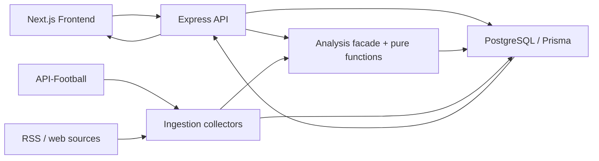

# Architecture

## System Flow

## Runtime Responsibilities

| Component | Responsibility | Does not own |
| --- | --- | --- |
| Frontend | UI rendering, SEO, authentication UX, API consumption | Domain calculation and normal business-data DB access |
| API | HTTP contract, parameter handling, auth, rate limiting, cache, response composition | External data collection and core calculation rules |
| Ingestion | Scheduled external collection, idempotent upsert, signal extraction, derived-state refresh | User-facing response contracts |
| Analysis | Player weight, injury impact, predicted lineup, performance/outcome calculations | HTTP handling, external API calls, DB writes |
| Database | Prisma schema, migrations, storage contract | Business decision logic |

## Important Implementation Note

`analysis` has a layered internal shape: data-access functions query Prisma, then `*Pure` functions calculate domain results. This makes core calculations testable; however, the public facade still accepts `PrismaClient`. It is therefore a read-coupled calculation layer, not a fully isolated pure domain package.

## Data Freshness Strategy

- Main sync defaults to hourly (`30 * * * *`).
- Recovery-signal collection defaults to every odd hour when the relevant key is configured.
- The incremental sync refreshes current-season fixtures and injuries, processes recent incomplete fixture detail, then refreshes derived injury status.
- API responses use TTL caches; a response can be fresh within its endpoint TTL even after a DB update.

포트폴리오 서술과 기술 선택 근거는 루트 [README](../README.md)에서 확인할 수 있습니다.
